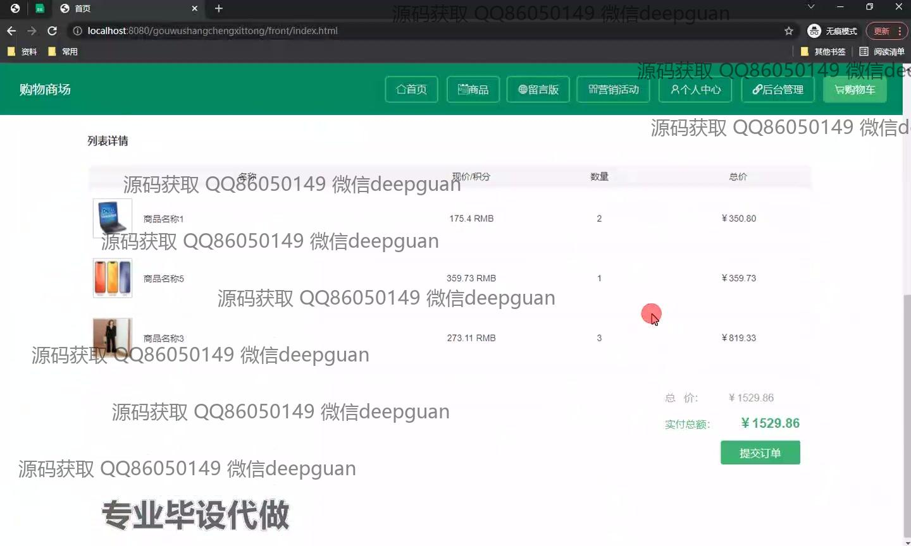

<h1 align="center">基于vue.js的购物商场的设计与实现+vue</h1>

## 简介
购物商城系统：角色分为管理员、用户；支持商品管理、订单管理、留言管理、营销活动管理等功能，界面简洁直观，用户体验出色。    --计算机毕业设计源码；毕设源码；java毕业设计源码

## 联系方式

<h3 align="center">获取完整代码与数据库文件 + 微信：deepguan QQ: 86050149 QQ群: 783742310</h3>

<h3 align="center">可帮忙远程部署 包运行成功！提供远程部署、修改代码、设计文档指导、代码讲解等服务！</h3>

## 功能介绍（完整见运行截图）
管理员：登录页面提供用户名、密码及角色选择的功能；管理系统包括商品管理、订单管理、营销活动管理、留言管理，支持商品和营销活动的筛选、修改、上架/下架等操作；可通过导航菜单访问首页、个人中心，查看和退出用户信息；支持留言筛选和用户反馈管理。

用户：用户可通过登录页面注册或登录商城系统；用户首页提供商品展示、留言板、营销活动和个人中心功能；购物车模块详细展示商品名称、单价、数量和结算总价，以及提交订单功能；用户中心支持个人信息查看与修改、订单查询及收藏管理；充值页面提供多种支付方式选择进行账户充值。

游客：在登录页面中，游客可以选择注册成为用户或管理员角色；在商城首页，游客可以浏览商品展示和活动信息；游客可通过留言板功能提交反馈、查看历史留言和回复内容；无需登录即可查看商品列表、活动标题等公共信息。

开发者：系统基于Vue.js开发，界面包括主页、商品管理、订单管理、营销活动管理、及后台管理；使用SSM框架开发，支持多种角色的权限管理和操作功能；页面UI布局简洁，响应式设计以提升用户体验；提供详细的业务逻辑与功能模块，适合用于毕业设计和商业应用。

## 运行截图

本代码来源于网络,仅供学习参考使用!

